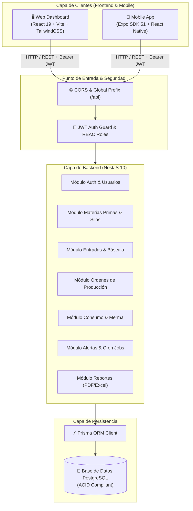
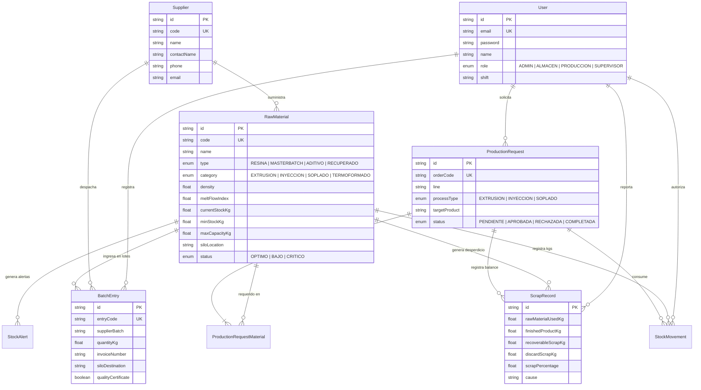

# 🏛️ Arquitectura del Sistema - PlastControl

Documento de diseño arquitectónico, patrones estructurales, modelo de datos y flujos de negocio del sistema de control de materia prima para la planta de manufactura plástica.

---

## 📌 Tabla de Contenidos
1. [Visión General de la Arquitectura](#1-visión-general-de-la-arquitectura)
2. [Diagrama de Componentes y Ecosistema](#2-diagrama-de-componentes-y-ecosistema)
3. [Modelo de Datos y Diagrama Entidad-Relación (ERD)](#3-modelo-de-datos-y-diagrama-entidad-relación-erd)
4. [Flujos de Negocio e Integridad Transaccional](#4-flujos-de-negocio-e-integridad-transaccional)
5. [Seguridad y Matriz de Roles (RBAC)](#5-seguridad-y-matriz-de-roles-rbac)
6. [Patrones de Software Implementados](#6-patrones-de-software-implementados)

---

## 1. Visión General de la Arquitectura

**PlastControl** está concebido bajo una arquitectura **Monorepo Multicapa** orientada a servicios desacoplados:
* **Capa de Presentación Web:** Single Page Application (SPA) construida con React 19 y Vite para supervisores, administradores y jefes de planta.
* **Capa de Movilidad Operativa:** App móvil desarrollada en React Native y Expo SDK 51 diseñada para operarios en patio de descarga, báscula y almacén.
* **Capa de Servicios y Negocio:** API REST modular construida sobre NestJS 10, aplicando arquitectura hexagonal/modular, controladores delgados y servicios con lógica de dominio.
* **Capa de Persistencia y Acceso a Datos:** PostgreSQL orquestado mediante Prisma ORM con tipado estricto extremo a extremo (End-to-End Type Safety).

---

## 2. Diagrama de Componentes y Ecosistema

---

## 3. Modelo de Datos y Diagrama Entidad-Relación (ERD)

El modelo de datos refleja fielmente los requerimientos de trazabilidad física y química de materias primas plásticas (MFI, densidad, lotes petroquímicos, silos y mermas):

---

## 4. Flujos de Negocio e Integridad Transaccional

### A. Recepción de Materia Prima en Báscula (`BatchEntry`)
1. El operario de almacén registra la entrada en la app móvil o web ingresando peso bruto, peso tara y peso neto de resina.
2. Se verifica la existencia del certificado de calidad del fabricante y el lote petroquímico (Braskem, Alpek, etc.).
3. **Transacción ACID (`prisma.$transaction`):**
   * Se crea el registro inmutable de `BatchEntry`.
   * Se incrementa `currentStockKg` en el registro de `RawMaterial`.
   * Se evalúa si el stock supera la capacidad máxima de la tolva/silo.
   * Se crea un registro de auditoría en `StockMovement` con tipo `ENTRADA`.

### B. Despacho y Consumo en Línea de Producción (`ProductionRequest`)
1. El supervisor genera una Orden de Producción (OP) con la lista de materiales requeridos (BOM: Resina base + Masterbatch color + Aditivo UV).
2. Al ser aprobada y despachada:
   * Se descuenta el stock de las materias primas correspondientes.
   * Si el stock resultante cae por debajo de `minStockKg`, el sistema actualiza automáticamente el estado a `BAJO` o `CRITICO` y dispara un `StockAlert`.

### C. Registro de Balance de Masa y Mermas (`ScrapRecord`)
Al finalizar el turno o lote de producción, se ingresan las métricas de pesaje físico:
$$\text{Materia Prima Utilizada} = \text{Producto Terminado} + \text{Merma Recuperable} + \text{Merma Descarte}$$
$$\% \text{ Merma} = \frac{\text{Merma Recuperable} + \text{Merma Descarte}}{\text{Materia Prima Utilizada}} \times 100$$
* **Merma Recuperable:** Trozos o recortes limpios aptos para molienda interna y reincorporación como peletizado recuperado.
* **Merma Descarte:** Purgas degradadas, material quemado o contaminado en arranque/parada de máquina.

---

## 5. Seguridad y Matriz de Roles (RBAC)

El acceso a los endpoints se controla mediante tokens **JWT (JSON Web Tokens)** firmados con algoritmo HMAC-SHA256, verificados por un `JwtAuthGuard` y evaluados mediante un decorador `@Roles(...)`.

| Módulo / Funcionalidad | ADMIN | ALMACEN | PRODUCCION | SUPERVISOR |
| :--- | :---: | :---: | :---: | :---: |
| **Gestión de Usuarios y Roles** | ✅ | ❌ | ❌ | ❌ |
| **Catálogo de Materias Primas** | ✅ | ✅ | Lectura | ✅ |
| **Entradas por Báscula y Lotes** | ✅ | ✅ | ❌ | Lectura |
| **Solicitar Orden de Producción** | ✅ | ❌ | ✅ | ✅ |
| **Aprobar Despacho de Material** | ✅ | ✅ | ❌ | ✅ |
| **Registro de Merma y Balance** | ✅ | ❌ | ✅ | ✅ |
| **Exportación de Reportes PDF/Excel** | ✅ | Lectura | ❌ | ✅ |

---

## 6. Patrones de Software Implementados

* **Data Transfer Object (DTO) Pattern:** Desacoplamiento estricto entre el payload HTTP entrante y las entidades de persistencia interna, asegurando validación por listas blancas (`whitelist: true`).
* **Repository / ORM Pattern:** Aislamiento del dialecto SQL a través del cliente tipado de Prisma.
* **Scheduled Tasks (Cron Jobs):** Automatización con `@nestjs/schedule` para monitoreo periódico de niveles de silos y emisión de notificaciones preventivas.
* **Single Source of Truth (SSOT):** Configuración unificada mediante variables de entorno centralizadas y validadas al arrancar cada servicio.
