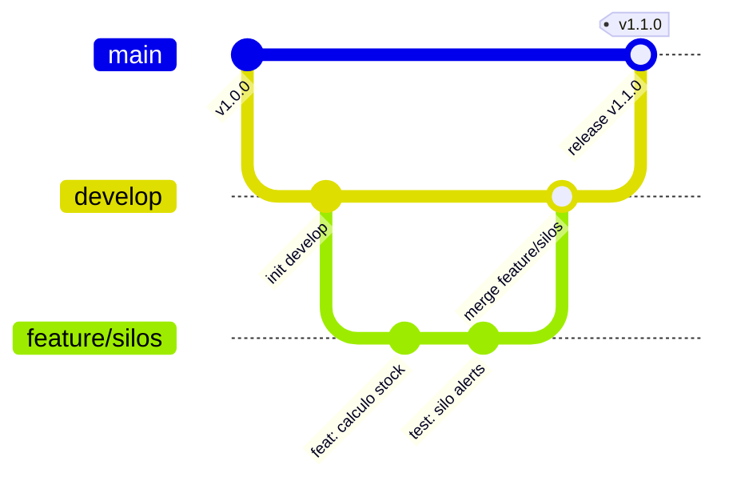

# 🤝 Guía de Contribución y Convenciones de Git (Git Conventions)

¡Bienvenido a la guía de estándares y colaboración del proyecto **PlastControl**! 
Este documento define las directrices profesionales que todo el equipo de desarrollo debe seguir para mantener un historial de control de versiones limpio, rastreable y sin fricciones.

---

## 📌 Tabla de Contenidos
1. [Estrategia de Ramas (Branching Strategy)](#1-estrategia-de-ramas-branching-strategy)
2. [Convención de Commits (Conventional Commits)](#2-convención-de-commits-conventional-commits)
3. [Flujo de Trabajo para Pull Requests (PR)](#3-flujo-de-trabajo-para-pull-requests-pr)
4. [Estándares de Código y Buenas Prácticas](#4-estándares-de-código-y-buenas-prácticas)

---

## 1. Estrategia de Ramas (Branching Strategy)

Seguimos una metodología basada en ramas de características (**Feature Branch Workflow** adaptado a GitFlow profesional):



### Ramas Principales
* **`main`**: Rama protegida que representa el código listo para producción. **Nunca se hace commit directo en `main`**.
* **`develop`** (o ramas de integración grupal): Rama base para integrar todas las características antes de pasar a producción.

### Nomenclatura de Ramas de Trabajo
Toda nueva tarea debe partir de una rama con el siguiente formato:

| Prefijo | Propósito | Ejemplo |
| :--- | :--- | :--- |
| `feature/` | Nueva funcionalidad o módulo | `feature/pesaje-bascula`, `feature/Abel`, `feature/kpis-scrap` |
| `fix/` o `bugfix/` | Corrección de un error en desarrollo | `fix/calculo-merma-division-cero` |
| `hotfix/` | Corrección crítica urgente para `main` | `hotfix/jwt-expiration-error` |
| `refactor/` | Reestructuración de código sin alterar lógica | `refactor/normalizar-servicios-api` |
| `docs/` | Mejoras o adición de documentación | `docs/actualizar-api-endpoints` |

---

## 2. Convención de Commits (Conventional Commits)

Implementamos el estándar internacional **[Conventional Commits v1.0.0](https://www.conventionalcommits.org/)**.

### Estructura del Mensaje
```text
<tipo>(<alcance opcional>): <descripción breve en minúsculas y modo imperativo>

[cuerpo opcional con detalles del porqué del cambio]

[pie de página opcional: referencias a issues o BREAKING CHANGE]
```

### Tipos Permitidos

| Tipo | Descripción | Ejemplo Real en PlastControl |
| :--- | :--- | :--- |
| **`feat`** | Una nueva funcionalidad para el usuario | `feat(entries): agregar registro de certificado de calidad en recepción` |
| **`fix`** | Corrección de un bug | `fix(silos): corregir cálculo de capacidad porcentual en tolvas` |
| **`docs`** | Cambios únicamente en documentación | `docs(readme): añadir diagrama de arquitectura e instrucciones de docker` |
| **`style`** | Formateo, puntos y comas, espacios (sin cambios de código funcional) | `style(frontend): formatear componentes de dashboard con prettier` |
| **`refactor`** | Cambio de código que no arregla un bug ni agrega una funcionalidad | `refactor(backend): modularizar cálculo de merma recuperable a servicio dedicado` |
| **`perf`** | Mejora de rendimiento | `perf(prisma): optimizar consulta de stock con índices en siloLocation` |
| **`test`** | Agregar o corregir pruebas unitarias o e2e | `test(auth): agregar pruebas unitarias para guardias de roles JWT` |
| **`chore`** | Tareas de mantenimiento, dependencias o configuración de build | `chore(deps): actualizar nestjs a version 10.4.0` |

### Alcances Recomendados (`scope`)
Utiliza alcances claros para indicar la zona del monorepo afectada:
- `auth`: Autenticación, JWT, roles.
- `materials`: Materias primas, resinas, aditivos.
- `entries`: Báscula, entradas de lote y facturas.
- `orders`: Órdenes de producción (OP).
- `silos`: Almacenamiento, capacidades y alertas.
- `scrap`: Merma recuperable y descartada.
- `mobile`: Aplicación móvil Expo.
- `web`: Dashboard React.
- `db`: Esquema de base de datos o migraciones de Prisma.

---

## 3. Flujo de Trabajo para Pull Requests (PR)

### 1. Mantén tu rama actualizada antes de abrir PR
Siempre sincroniza tu rama con los últimos cambios de la rama base:
```bash
git checkout feature/mi-rama
git fetch origin
git merge origin/main   # o rebase según la preferencia del equipo
```

### 2. Abrir el Pull Request en GitHub
1. Asigna un título descriptivo siguiendo Conventional Commits (ej: `feat(web): implementar calculadora de recetas BOM`).
2. Completa la plantilla estándar de PR ([`.github/PULL_REQUEST_TEMPLATE.md`](.github/PULL_REQUEST_TEMPLATE.md)).
3. Vincula el Issue o tarea correspondiente si aplica.
4. Adjunta capturas de pantalla o logs de prueba si el cambio incluye UI o endpoints nuevos.

### 3. Criterios de Aprobación (Definition of Done)
- [x] El código compila sin errores (`npm run build` en backend y frontend).
- [x] Los linters no arrojan errores (`npm run lint`).
- [x] No se introdujeron secretos ni archivos temporales.
- [x] Al menos un compañero de equipo o líder técnico aprueba el cambio.

---

## 4. Estándares de Código y Buenas Prácticas

1. **TypeScript Estricto:** Evita el uso indiscriminado de `any`. Define interfaces y tipos para cada payload de la API.
2. **Validación en Backend:** Todo endpoint de entrada debe validar sus datos mediante DTOs con decoradores de `class-validator` (`@IsNotEmpty`, `@IsNumber`, `@IsPositive`).
3. **Transacciones ACID:** Todo movimiento que afecte inventario (entradas, despachos de producción, mermas) debe ejecutarse dentro de una transacción (`prisma.$transaction`) para asegurar consistencia.
4. **Resiliencia en Frontend:** Las llamadas a la API deben manejar estados de carga (`isLoading`), éxito y error con mensajes claros para los operarios de la planta.
