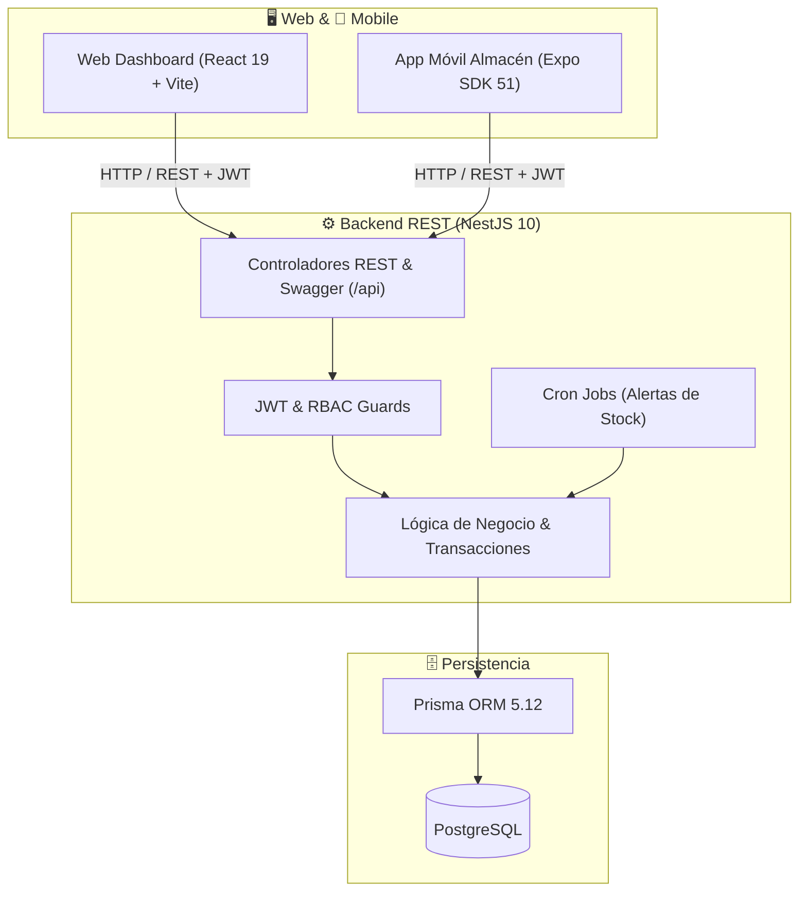

# 🏭 PlastControl — Sistema de Control de Materia Prima y Planta

<div align="center">

[](https://www.typescriptlang.org/)
[](https://nestjs.com/)
[](https://react.dev/)
[](https://vitejs.dev/)
[](https://expo.dev/)
[](https://tailwindcss.com/)
[](https://www.prisma.io/)
[](https://www.postgresql.org/)
[](https://www.docker.com/)

**Solución integral empresarial para la gestión de inventarios, pesaje en báscula, silos, órdenes de producción, despacho de materia prima y control de mermas en plantas de extrusión, inyección y soplado de plástico.**

[Documentación de Arquitectura](ARCHITECTURE.md) • [Catálogo de API REST](API.md) • [Catálogo de Librerías](LIBRARIES.md) • [Guía de Contribución & Git](CONTRIBUTING.md) • [Manual de Agentes IA](AGENTS.md)

</div>

---

## 🎯 Guía de Entregables y Evaluación (Para Revisión Docente / Técnica)

En respuesta a los requerimientos de estandarización profesional solicitados para el proyecto, a continuación se presenta la matriz de ubicación de cada entregable:

| Requerimiento Solicitado | Archivo / Ubicación | Descripción Profesional Implementada |
| :--- | :--- | :--- |
| **1. README** | [`README.md`](README.md) | Portal principal con insignias, arquitectura, quickstart, credenciales demo y tablas de comandos. |
| **2. Git Convention** | [`CONTRIBUTING.md`](CONTRIBUTING.md) y [Sección Git](#-convenciones-de-git-y-flujo-de-comandos) | Estándar Conventional Commits v1.0.0, estrategia de ramas (GitFlow), comandos Git y [plantilla de PR](.github/PULL_REQUEST_TEMPLATE.md). |
| **3. Git Ignore** | [`.gitignore`](.gitignore) | Configuración monorepo blindada contra fugas de `.env`, secretos, `dist/`, `.expo/`, `.vscode/` y temporales de OS. |
| **4. MD Files (Suite Técnica)** | [Documentación Markdown](#-suite-de-documentación-técnica-archivos-md) | Suite desacoplada: `README.md`, `ARCHITECTURE.md`, `API.md`, `LIBRARIES.md`, `CONTRIBUTING.md` y `AGENTS.md`. |
| **5. Stack Tecnológico** | [Sección Stack](#%EF%B8%8F-stack-tecnol%C3%B3gico-justificado) | Ficha técnica con versiones y justificación arquitectónica (NestJS 10, React 19, Expo 51, Prisma, PostgreSQL). |
| **6. Librerías Utilizadas** | [`LIBRARIES.md`](LIBRARIES.md) | Catálogo exhaustivo de todas las librerías NPM de Backend, Web y Mobile con versiones y casos de uso en planta. |
| **7. Agentes de IA** | [`AGENTS.md`](AGENTS.md) | Manual de directrices, glosario de plásticos y guardrails de seguridad para asistentes como Antigravity, Cursor y Copilot. |
| **8. Skills** | [`.agents/skills/`](.agents/skills/) | Habilidades modulares (`seed-and-test`, `create-api-module`, `git-workflow`) en formato estándar `SKILL.md`. |
| **9. Comandos para Correr** | [Tabla Maestra de Comandos](#-tabla-maestra-de-comandos-de-ejecuci%C3%B3n) | Resumen unificado de todos los comandos de desarrollo, base de datos, compilación, pruebas y linteo. |

---

## 📖 Descripción del Problema y Solución

En las plantas industriales de transformación de plásticos, el control de materia prima representa hasta el **70% del costo operativo**. Los errores en la dosificación de resinas (HDPE, PP, LDPE), la falta de trazabilidad en lotes petroquímicos, los silos desbordados o vacíos y el registro tardío de merma (scrap) generan pérdidas económicas significativas.

**PlastControl** resuelve esta problemática conectando tres frentes operativos en tiempo real:
1. **Patio de Descarga y Almacén (Móvil):** Registro de pesaje bruto/tara en báscula, validación de certificados de calidad de resina y asignación automática a silos.
2. **Líneas de Producción (Web Dashboard):** Emisión y aprobación de Órdenes de Producción (OP), despacho atómico con descuento de inventario y calculadora de recetas BOM.
3. **Control de Calidad y Mermas (Reportes):** Registro de balance de masa (producto terminado vs. merma recuperable de molienda vs. purga de descarte) y cálculo automático de indicadores KPI.

---

## 🏛️ Arquitectura del Sistema

El proyecto está diseñado como un **Monorepo Multicapa** con separación estricta de responsabilidades:



Para una explicación a fondo del modelo Entidad-Relación (ERD) y los diagramas de secuencia, consulta [ARCHITECTURE.md](ARCHITECTURE.md).

---

## 🛠️ Stack Tecnológico Justificado

A nivel profesional, cada tecnología en PlastControl fue seleccionada por criterios de escalabilidad, seguridad, rendimiento y madurez en el ecosistema:

| Capa | Tecnología | Versión | Rol en el Sistema | Justificación Técnica de Selección |
| :--- | :--- | :--- | :--- | :--- |
| **Backend** | **NestJS** | `^10.0.0` | Núcleo de la API REST | Arquitectura modular inspirada en Angular, inyección de dependencias de primera clase y soporte nativo de TypeScript para código robusto y testeable. |
| **ORM** | **Prisma** | `^5.12.0` | Mapeo Objeto-Relacional | Tipado estricto automático generado desde el esquema, migraciones declarativas y soporte de transacciones ACID (`$transaction`) indispensables para inventarios. |
| **Base de Datos** | **PostgreSQL** | `16` | Persistencia Relacional | Motor transaccional líder en consistencia ACID, manejo de índices concurrentes y alta confiabilidad para volúmenes industriales. |
| **Seguridad** | **Passport + JWT** | `^10.2.0` | Autenticación y RBAC | Tokens sin estado (stateless) para comunicación segura y desacoplada entre clientes Web/Mobile y la API, cifrado con `bcrypt`. |
| **Frontend Web** | **React** | `^19.2.8` | Interfaz de Administración | El estándar de la industria para interfaces reactivas, con renderizado eficiente y ecosistema de hooks para flujos de planta. |
| **Bundler Web** | **Vite** | `^6.2.0` | Empaquetador y Dev Server | Hot Module Replacement (HMR) casi instantáneo y compilación optimizada con Rollup para tiempos de carga mínimos. |
| **Estilos Web** | **TailwindCSS** | `^3.4.17` | Sistema de Diseño Visual | Diseño utilitario que evita CSS redundante, facilitando temas visuales industriales (estados de silos, alertas y KPIs). |
| **Mobile** | **React Native + Expo** | `SDK 51` | Aplicación Móvil Operativa | Desarrollo multiplataforma (Android/iOS) con acceso rápido a red, cámara/QR para lotes y almacenamiento local con `AsyncStorage`. |
| **DevOps** | **Docker & Compose** | `3.8+` | Contenedores | Entorno reproducible de PostgreSQL y servicios, garantizando paridad entre desarrollo local y producción. |

> [!TIP]
> Para conocer el inventario detallado de cada paquete NPM, utilidades de validación (`class-validator`), generadores de reportes (`exceljs`, `pdfkit`), iconos (`lucide`), persistencia local (`async-storage`) y herramientas de prueba, consulta el [Catálogo Estructurado de Librerías (LIBRARIES.md)](LIBRARIES.md).

---

## 📁 Estructura del Monorepo

```
ContaPlastico/
├── backend/                  # API REST NestJS, Prisma y PostgreSQL
│   ├── prisma/               # Esquema de base de datos y scripts de seed
│   ├── src/                  # Módulos de dominio (auth, materials, entries, production, etc.)
│   └── test/                 # Pruebas unitarias y de integración
├── frontend-web/             # Dashboard web React 19 + Vite
│   ├── src/components/       # Vistas de silos, báscula, líneas de producción y mermas
│   └── src/services/         # Clientes de API con fallback demo y normalización
├── mobile-app/               # Aplicación móvil Expo para operarios de almacén
│   └── src/screens/          # Pantallas de inventario, entradas y movimientos
├── .agents/                  # Configuración de Agentes IA y Habilidades (skills)
│   └── skills/               # Habilidades de automatización (seed-and-test, create-api-module, git-workflow)
├── .github/                  # Plantilla de Pull Request y flujos de colaboración
├── API.md                    # Catálogo formal de endpoints y payloads REST
├── ARCHITECTURE.md           # Diseño arquitectónico, diagramas y modelo ERD
├── CONTRIBUTING.md           # Convenciones de Git y guía de contribución
├── AGENTS.md                 # Directrices para asistentes y agentes de IA
└── docker-compose.yml        # Orquestación de servicios locales
```

---

## 🚀 Puesta en Marcha Rápida (Quickstart)

### Requisitos Previos
* **Node.js** >= `18.0.0`
* **npm** >= `9.0.0`
* **Docker Desktop** (o servicio local de PostgreSQL en el puerto `5432`)
* Aplicación **Expo Go** en tu dispositivo móvil (opcional para pruebas en físico)

---

### Paso 1: Clonar y Levantar la Base de Datos

```bash
# Iniciar el contenedor de PostgreSQL
docker compose up -d postgres
```

### Paso 2: Configurar y Arrancar el Backend

```bash
cd backend

# Copiar variables de entorno
cp .env.example .env

# Instalar dependencias
npm install

# Generar cliente y aplicar migraciones
npm run prisma:generate
npm run prisma:migrate

# Sembrar datos de demostración
npm run db:seed

# Iniciar servidor en modo desarrollo
npm run start:dev
```
* 🟢 **Backend API:** `http://localhost:3000/api`
* 📑 **Documentación Swagger:** `http://localhost:3000/api/docs`

---

### Paso 3: Arrancar el Dashboard Web

En una nueva terminal:
```bash
cd frontend-web
npm install
npm run dev
```
* 🟢 **Web App:** `http://localhost:5173`

---

### Paso 4: Arrancar la App Móvil

En una nueva terminal:
```bash
cd mobile-app
npm install
npx expo start
```
* Escanea el código QR desde la app **Expo Go** (Android) o la cámara (iOS).

---

## 🔑 Credenciales de Demostración (Seed Data)

El script de inicialización (`npm run db:seed`) carga usuarios preconfigurados con contraseñas cifradas en `bcrypt` (`password123`):

| Correo Electrónico | Contraseña | Rol Asignado | Permisos y Alcance |
| :--- | :--- | :--- | :--- |
| `admin@plastcontrol.com` | `password123` | `ADMIN` | Acceso total al sistema, auditoría y configuración de usuarios. |
| `almacen@plastcontrol.com` | `password123` | `ALMACEN` | Registro en báscula, recepción de lotes y despacho de silos. |
| `produccion@plastcontrol.com` | `password123` | `PRODUCCION` | Solicitud de OPs, balance de masa y reporte de scrap. |
| `supervisor@plastcontrol.com` | `password123` | `SUPERVISOR` | Aprobación de órdenes, monitoreo de KPIs y reportes PDF/Excel. |

---

---

## 💻 Tabla Maestra de Comandos de Ejecución

A continuación se consolidan todos los comandos necesarios para el ciclo de vida del proyecto en desarrollo, pruebas y producción:

### ⚙️ Backend (`/backend`)

| Acción | Comando | Descripción |
| :--- | :--- | :--- |
| **Instalar dependencias** | `npm install` | Instala paquetes de NestJS, Prisma y utilidades. |
| **Iniciar en desarrollo** | `npm run start:dev` | Arranca NestJS con recarga automática (*watch mode*) en puerto 3000. |
| **Compilar producción** | `npm run build` | Transpila TypeScript a JavaScript en la carpeta `/backend/dist`. |
| **Iniciar en producción** | `npm run start:prod` | Ejecuta el build compilado con Node.js. |
| **Generar cliente Prisma** | `npm run prisma:generate` | Regenera `@prisma/client` a partir de `schema.prisma`. |
| **Aplicar migraciones** | `npm run prisma:migrate` | Aplica migraciones pendientes de PostgreSQL en desarrollo. |
| **Visualizar BD (GUI)** | `npm run prisma:studio` | Abre interfaz gráfica de Prisma en `http://localhost:5555`. |
| **Sembrar datos demo** | `npm run db:seed` | Puebla la BD con usuarios, resinas, silos y entradas de prueba. |
| **Ejecutar pruebas unitarias** | `npm run test` | Corre la suite de pruebas automatizadas con Jest. |
| **Pruebas en modo watch** | `npm run test:watch` | Ejecuta pruebas interactivas ante cada cambio de código. |

---

### 🌐 Frontend Web (`/frontend-web`)

| Acción | Comando | Descripción |
| :--- | :--- | :--- |
| **Instalar dependencias** | `npm install` | Instala paquetes de React 19, Tailwind y Vite. |
| **Iniciar en desarrollo** | `npm run dev` | Arranca servidor Vite con HMR en `http://localhost:5173`. |
| **Compilar para producción** | `npm run build` | Empaqueta y minifica la app en `/frontend-web/dist`. |
| **Analizar código (Linter)** | `npm run lint` | Ejecuta `oxlint` para análisis estático y detección de errores. |
| **Previsualizar build** | `npm run preview` | Sirve la compilación de producción localmente para pruebas. |

---

### 📱 Mobile App (`/mobile-app`)

| Acción | Comando | Descripción |
| :--- | :--- | :--- |
| **Instalar dependencias** | `npm install` | Instala paquetes de Expo SDK 51 y React Native. |
| **Iniciar Metro Bundler** | `npx expo start` | Genera código QR interactivo para Expo Go. |
| **Ejecutar en Android** | `npm run android` | Lanza emulador o dispositivo Android conectado. |
| **Ejecutar en iOS** | `npm run ios` | Lanza simulador de iOS (requiere macOS). |
| **Ejecutar versión Web** | `npm run web` | Compila y levanta la app móvil en el navegador web. |
| **Verificación de tipos** | `npm run typecheck` | Comprueba tipos de TypeScript con `tsc --noEmit`. |

---

### 🐳 Docker & Base de Datos (Raíz `/`)

| Acción | Comando | Descripción |
| :--- | :--- | :--- |
| **Levantar PostgreSQL** | `docker compose up -d postgres` | Inicia el contenedor de base de datos en segundo plano. |
| **Ver estado de contenedores** | `docker compose ps` | Lista el estado y puertos de los contenedores Docker. |
| **Detener contenedores** | `docker compose down` | Detiene y remueve los contenedores de desarrollo. |
| **Reiniciar con volúmenes limpios** | `docker compose down -v && docker compose up -d` | Reinicia la base de datos limpia desde cero. |

---

## 🔀 Convenciones de Git y Flujo de Comandos

Todo el equipo de desarrollo debe cumplir rigurosamente el estándar **Conventional Commits v1.0.0** y el flujo de ramas documentado en [CONTRIBUTING.md](CONTRIBUTING.md).

### Formato Obligatorio del Commit
```text
<tipo>(<alcance>): <descripción imperativa en minúsculas>
```

| Tipo | Propósito | Ejemplo Real en PlastControl |
| :--- | :--- | :--- |
| **`feat`** | Nueva funcionalidad | `feat(silos): agregar cálculo de capacidad porcentual en tolvas` |
| **`fix`** | Corrección de error | `fix(auth): corregir expiración de token JWT en app móvil` |
| **`docs`** | Documentación | `docs(readme): añadir tabla maestra de comandos y guía de entregables` |
| **`refactor`** | Refactorización de código | `refactor(backend): modularizar cálculo de merma a servicio dedicado` |
| **`perf`** | Mejora de rendimiento | `perf(prisma): indexar columna siloLocation para optimizar stock` |
| **`test`** | Pruebas unitarias o e2e | `test(entries): añadir pruebas de integración para pesaje en báscula` |
| **`chore`** | Mantenimiento y configs | `chore(deps): actualizar nestjs a version 10.4.0` |

### 🛠️ Flujo de Comandos Git Paso a Paso

```powershell
# 1. Crear o ubicarse en una rama de trabajo
git checkout -b feature/nombre-de-la-funcionalidad

# 2. Verificar archivos modificados (asegurar que .gitignore actúe)
git status

# 3. Preparar archivos para el commit
git add .

# 4. Crear commit respetando Conventional Commits
git commit -m "feat(entries): registrar certificado de calidad en recepcion de lote"

# 5. Sincronizar con los últimos cambios de main antes de subir
git fetch origin main
git merge origin/main

# 6. Subir rama a GitHub
git push -u origin feature/nombre-de-la-funcionalidad
```

> [!NOTE]
> Al abrir el Pull Request en GitHub, utiliza la plantilla preconfigurada en [`.github/PULL_REQUEST_TEMPLATE.md`](.github/PULL_REQUEST_TEMPLATE.md).

---

## 📑 Suite de Documentación Técnica (Archivos .MD)

Para garantizar la mantenibilidad del software, la documentación está organizada modularmente en archivos Markdown dedicados:

* 📘 **[`README.md`](README.md):** Manual principal, quickstart, credenciales demo, matriz de entregables y tablas de comandos.
* 🏛️ **[`ARCHITECTURE.md`](ARCHITECTURE.md):** Arquitectura multicapa, diagramas Mermaid (arquitectura y ERD de base de datos), flujos de pesaje/merma y matriz de roles RBAC.
* 🌐 **[`API.md`](API.md):** Catálogo formal de endpoints REST, métodos HTTP, cabeceras de autorización Bearer JWT y ejemplos de payloads.
* 📚 **[`LIBRARIES.md`](LIBRARIES.md):** Inventario detallado de cada librería de Backend, Web y Mobile con su versión y justificación técnica.
* 🤝 **[`CONTRIBUTING.md`](CONTRIBUTING.md):** Guía de Git Conventions, estrategia de ramas (GitFlow), reglas de Conventional Commits y Pull Requests.
* 🤖 **[`AGENTS.md`](AGENTS.md):** Contexto, terminología de plásticos y guardrails para agentes y asistentes de IA.
* ⚡ **[`.agents/skills/`](.agents/skills/):** Habilidades operativas guiadas (`seed-and-test`, `create-api-module`, `git-workflow`).

---

## 🤖 Desarrollo Asistido por IA (Agentes y Skills)

Este repositorio está preparado para agentes de IA de ingeniería de software (Antigravity, Cursor, Copilot, Claude Code):
* **Directrices del Agente:** [AGENTS.md](AGENTS.md)
* **Skills Automatizadas:** Ubicadas en `.agents/skills/`:
  * [`seed-and-test`](.agents/skills/seed-and-test/SKILL.md): Inicialización y prueba de base de datos.
  * [`create-api-module`](.agents/skills/create-api-module/SKILL.md): Creación estandarizada de módulos NestJS.
  * [`git-workflow`](.agents/skills/git-workflow/SKILL.md): Guía para preparación de commits y PRs.

---

## 📄 Licencia y Autores

Proyecto desarrollado para la gestión y control de manufactura de plásticos.
Todos los derechos reservados © 2026.
